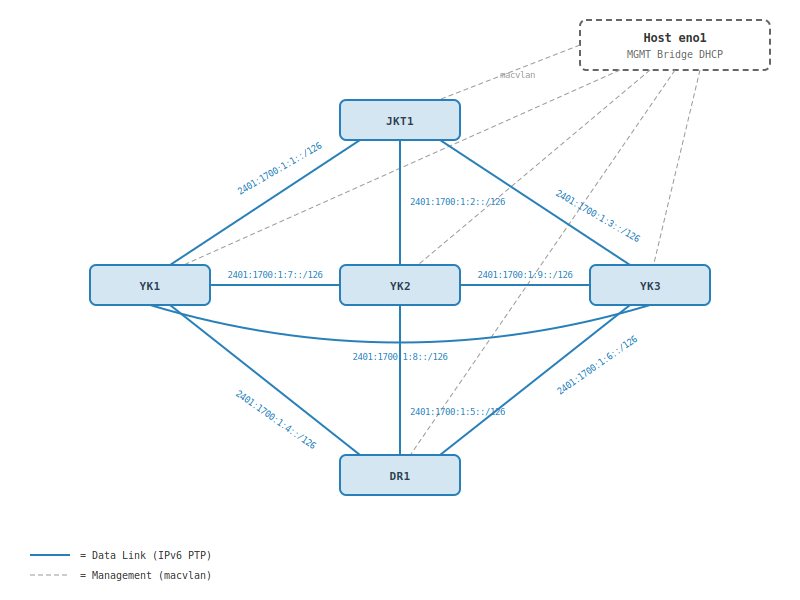

# BIRD 3 Docker Lab Environment

Lab lingkungan routing inter-koneksi PTP berbasis **BIRD 3.2.1** menggunakan Docker container. 
Project ini mereplikasi *behavior* perangkat keras / router sesungguhnya dengan menyajikan jaringan IPv6-ready untuk topologi Full-Mesh BGP/OSPF.

## Topologi (5 Nodes)
Proyek ini memuat lima node spesifik (dengan OS Debian 12):
1. **JKT1** (Loopback: `5.5.5.5`)
2. **DR1** (Loopback: `1.1.1.1`)
3. **YK1** (Loopback: `2.2.2.2`)
4. **YK2** (Loopback: `3.3.3.3`)
5. **YK3** (Loopback: `4.4.4.4`)



| Link | Subnet | Sisi A | Sisi B |
|------|--------|--------|--------|
| JKT1 ↔ YK1 | `2401:1700:1:1::/126` | `::2` (JKT1) | `::3` (YK1) |
| JKT1 ↔ YK2 | `2401:1700:1:2::/126` | `::2` (JKT1) | `::3` (YK2) |
| JKT1 ↔ YK3 | `2401:1700:1:3::/126` | `::2` (JKT1) | `::3` (YK3) |
| DR1 ↔ YK1 | `2401:1700:1:4::/126` | `::2` (DR1) | `::3` (YK1) |
| DR1 ↔ YK2 | `2401:1700:1:5::/126` | `::2` (DR1) | `::3` (YK2) |
| DR1 ↔ YK3 | `2401:1700:1:6::/126` | `::2` (DR1) | `::3` (YK3) |
| YK1 ↔ YK2 | `2401:1700:1:7::/126` | `::2` (YK1) | `::3` (YK2) |
| YK1 ↔ YK3 | `2401:1700:1:8::/126` | `::2` (YK1) | `::3` (YK3) |
| YK2 ↔ YK3 | `2401:1700:1:9::/126` | `::2` (YK2) | `::3` (YK3) |

Masing-masing router diisolasi pada Container yang diatur menggunakan `privileged: true` agar BIRD memiliki akses modifikasi pada tabel routing Kernel.

---

## Jaringan & Addressing

Docker Compose mengorkestrasikan beberapa komponen jaringan secara kompleks:

### 1. Management Interface (Macvlan)
Setiap router menggunakan interface yang ter-bridge via Macvlan ke antarmuka Host fisik `eno1`. Router meletikkan `dhclient` di belakang layar sehingga setiap container langsung meraup alamat IP secara dinamik dari range `192.168.x.x` router eksternal dari Host.

### 2. Point-to-Point (PTP) IPv6 Murni
Berbeda dari Lab biasa yang menggunakan bridge IPv4, Docker telah disesuaikan murni dengan *Dual-Stack Sysctls* IPv6. Setiap link khusus (seperti `ptp-jkt1-yk1`) telah di-hardcode memakai IP /126 yang statis.
**Daftar Link PTP Block (`2401:1700:1::/48`):**
* `ptp-jkt1-yk1`: `2401:1700:1:1::/126` -> (jkt1: `::2`, yk1: `::3`)
* `ptp-jkt1-yk2`: `2401:1700:1:2::/126` -> (jkt1: `::2`, yk2: `::3`)
* `ptp-jkt1-yk3`: `2401:1700:1:3::/126` -> (jkt1: `::2`, yk3: `::3`)
* `ptp-dr1-yk1`: `2401:1700:1:4::/126` -> (dr1: `::2`, yk1: `::3`)
* `ptp-dr1-yk2`: `2401:1700:1:5::/126` -> (dr1: `::2`, yk2: `::3`)
* `ptp-dr1-yk3`: `2401:1700:1:6::/126` -> (dr1: `::2`, yk3: `::3`)
* `ptp-yk1-yk2`: `2401:1700:1:7::/126` -> (yk1: `::2`, yk2: `::3`)
* `ptp-yk1-yk3`: `2401:1700:1:8::/126` -> (yk1: `::2`, yk3: `::3`)
* `ptp-yk2-yk3`: `2401:1700:1:9::/126` -> (yk2: `::2`, yk3: `::3`)

> **[Penting] Interface Index Priority:** Modifikasi `priority:` disuntikkan ke dalam `docker-compose.yml` agar Docker *selalu* menggunakan index interface hardware yang sama (seperti `eth0`, `eth4`) sesuai dengan ekspektasi string hardcode `interface "ethX"` yang tersimpan di dalam masing-masing file konfigurasi BIRD lokal secara persisten.

### 3. Loopback IPv4
Setiap Node mendapatkan IP identitas uniknya untuk *Router ID / BGP Updates* yang di-inject dari Environment Variable `LOOPBACK_IP`:
* `dr1` : 1.1.1.1/32
* `yk1` : 2.2.2.2/32
* `yk2` : 3.3.3.3/32
* `yk3` : 4.4.4.4/32
* `jkt1`: 5.5.5.5/32

---

## File Konfigurasi BIRD
Setiap perubahan pada rule Routing (seperti Filter/BGP PTP) dapat dilakukan tanpa perlu mengakses Container apalagi merebuild images, karena seluruh map konfigurasinya dipersistenkan di Host!
Path Konfigurasi BIRD yang aktif: **`/home/well/bird-lab/configs/`**

(Dapat langsung diedit dengan `nano/vim` lalu menjalankan `sudo docker exec jkt1 birdc configure`).

---

## Cara Akses / Shell

### Via Docker Exec (Tanpa Password)
Pendekatan cepat yang langsung berpusat pada Host Supermicro:
```bash
sudo docker exec -it jkt1 bash
```
> Eksekusi perintah cli protokol internal: `sudo docker exec -it jkt1 birdc show protocols`

### Via Remote SSH
Berkat paket penambahan `openssh-server`, Anda bisa melakukan remot SSH langsung dari client OS lain dari network DHCP Anda (192.168.248.0/21) menuju IP masing-masing container.

* **Username:** `root`
* **Password:** `root`

```bash
# Contoh akses:
ssh root@192.168.x.x
```

## Maintenance Images
Image dibuild lewat `Dockerfile` yang memanggil `start.sh` sebagai entrypoint loop. Di dalamnya, Docker akan menyingkirkan semua IP default `/16` IPv4 dari Docker bridge (kecuali IPv4 management DHCP) untuk melestarikan IPv6 Link Anda 100% rapi.

Tool diagnostik yang telah tertanam di dalam Container: `ping`, `mtr`, `tshark`, `tcpdump`, `iproute2`.

```bash
# Menyerah/restart Lab:
sudo docker compose down && sudo docker compose up -d
```

## Referensi

- [Massars Network Design](https://massars.net/design/)
